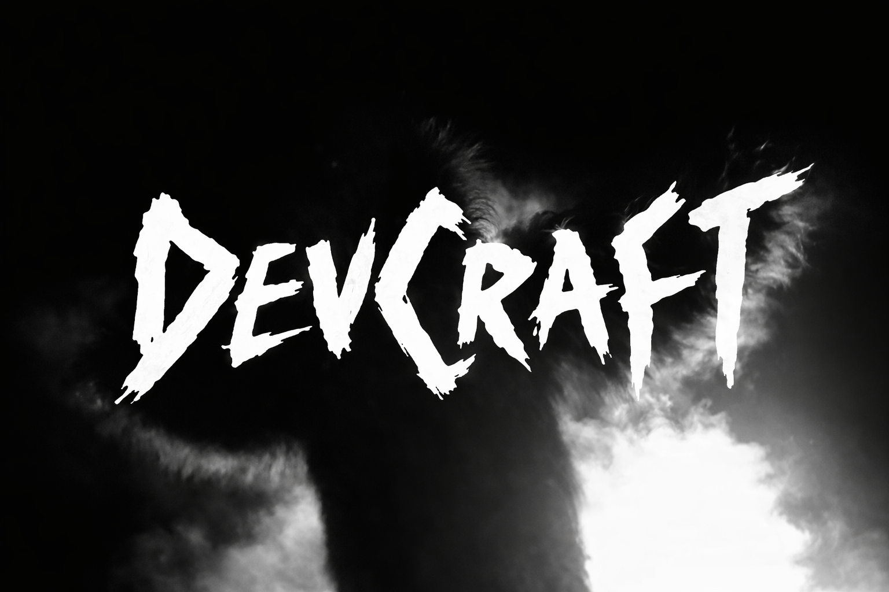

<div align="center">
  
</div>

# dev-craft-backend

**DevCraft** is a learning app for JavaScript and TypeScript interview prep. This NestJS service powers auth, knowledge topics, AI-assisted chat (including Discord), and MCP integration. See [Frontend repository](https://github.com/Maria2721/dev-craft-frontend)

## Tech stack

| Area           | Technologies                                                                                                                                                                                                                |
| -------------- | --------------------------------------------------------------------------------------------------------------------------------------------------------------------------------------------------------------------------- |
| Runtime        | **Node.js**, **TypeScript**                                                                                                                                                                                                 |
| Framework      | **NestJS**                                                                                                                                                                                                                  |
| Database       | **PostgreSQL**, **Prisma ORM**                                                                                                                                                                                              |
| Auth           | **JWT** (Passport), **bcrypt**, **OAuth 2.0** (Google, GitHub)                                                                                                                                                              |
| API docs       | **Swagger / OpenAPI** (`openapi/openapi.yaml`)                                                                                                                                                                              |
| AI             | Configurable LLM providers                                                                                                                                                                                                  |
| Integrations   | [**Dify**](https://github.com/langgenius/dify), [**MCP TypeScript SDK**](https://github.com/modelcontextprotocol/typescript-sdk), [**Discord.js**](https://github.com/discordjs/discord.js) (optional bot docker container) |
| Infra (Docker) | **Docker Compose**, **Caddy** (optional TLS reverse proxy), **ffmpeg** in Discord bot image                                                                                                                                 |
| Quality        | **ESLint**, **Prettier**, **Jest**, **Husky**, **lint-staged**                                                                                                                                                              |

## Quick start

1. **Clone the repository**

   ```bash
   git clone https://github.com/Maria2721/dev-craft-backend.git
   cd dev-craft-backend
   ```

2. **Configure environment**

   ```bash
   cp .env.example .env
   ```

   Edit `.env`: set at least `PORT`, `CORS_ORIGIN`, PostgreSQL variables, `DATABASE_URL` (for host-side tools if you use them), JWT secrets, and Swagger credentials. For AI features, set `AI_LLM_PROVIDER` and the matching block (`api_llm`, `local_llm`, or `dify_chatflow`). Dify-related variables are documented in `.env.example`.

3. **Start core services (backend application + database)**

   ```bash
   docker compose up -d --build postgres app
   ```

   The backend application listens on the host only if ports are published. For **local development without Caddy**, publish its port by adding a Compose override - copy `docker-compose.override.local.yml` to `docker-compose.override.yml` (this file is gitignored) so it is reachable at `http://<host>:<port>` (use your machine address and `PORT` from `.env`). **You do not need the Caddy container** for plain HTTP; Caddy is intended for HTTPS / production-style routing.

4. **Optional: Discord bot**

   The `discord-bot` service talks to the backend application and Dify. Start it only when you need Discord features and have set `DISCORD_BOT_*` (and related) variables:

   ```bash
   docker compose up -d --build discord-bot
   ```

   See the official **[Discord Developer Documentation](https://discord.com/developers/docs)** for creating a bot, intents, and tokens.

5. **Optional: Caddy (TLS in front of the backend application)**

   ```bash
   docker compose --profile caddy up -d --build caddy
   ```

   Requires `PUBLIC_DOMAIN` and correct DNS; use only when you want HTTPS like production.

## Verify the deployment

**Health check** - use your backend base URL: `<host>` is the hostname or IP, `<port>` matches `PORT` in `.env`. If you terminate TLS in front (e.g. Caddy), call `https://<host>/health` (no port in the URL when using default 443).

```bash
curl http://<host>:<port>/health
```

**Expected response when the backend application is healthy:**

```json
{ "ok": true }
```

## Lint and tests

Run inside the backend container (`app` service). Ensure the image is built (e.g. after `docker compose up` or `docker compose build app`).

```bash
docker compose run --rm app npm run lint
docker compose run --rm app npm run test
```

Coverage:

```bash
docker compose run --rm app npm run test:cov
```

## Project Structure

Top-level directories in this repository:

- `.github/` - GitHub Actions workflows (CI and deploy)
- `.husky/` - Git hooks (lint-staged and related)
- `architecture/` - architecture notes, ADRs, diagrams, and images (e.g. `architecture/img/`)
- `docker/` - Dockerfiles and Caddy config (`docker/node`, `docker/discord-bot`, `docker/caddy`)
- `openapi/` - OpenAPI YAML (`openapi/openapi.yaml`)
- `prisma/` - Prisma schema and migrations
- `scripts/` - helper scripts (deploy helpers, import seed)
- `seed/` - seed data (for example knowledge content under `seed/knowledge/`)
- `src/` - NestJS application source code
- `tests/` - Jest tests (mainly under `tests/unit/`)

## License

[MIT](LICENSE)
