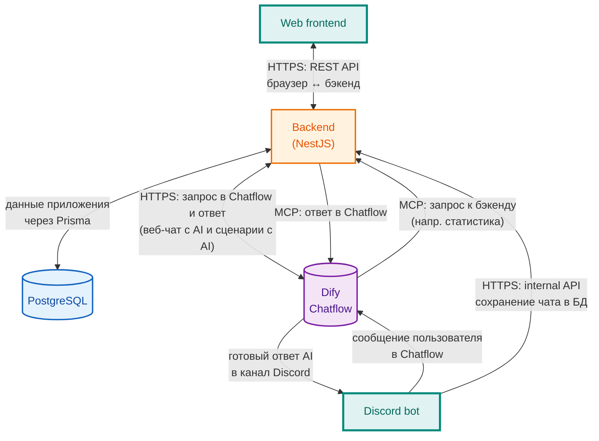
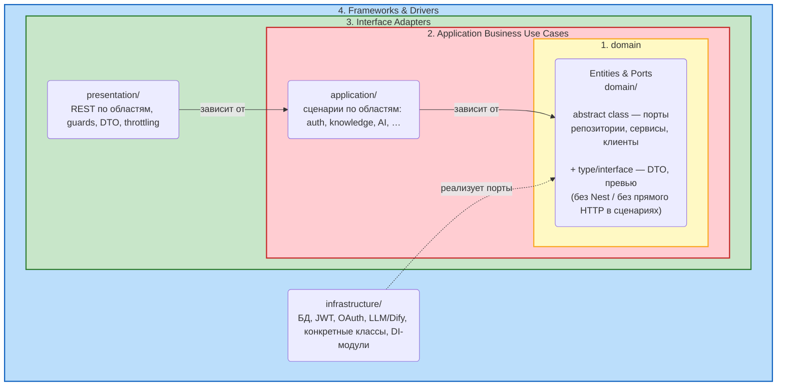

# Схемы Mermaid для [mermaideditor.com](https://mermaideditor.com/ru)

В репозитории версионируются **две** диаграммы (исходники ниже; готовый SVG - в [`diagrams/`](./diagrams/)).

---

## Диаграмма 1 — обзор: кто с кем говорит

Участники: **две точки входа** (веб и Discord-бот), бэкенд, база, Dify.

Авторизация (JWT) — [ADR-002](./adr/ADR-002-jwt-access-refresh.md); OAuth — [ADR-003](./adr/ADR-003-oauth-google-github.md). Граница данных и Dify — [ADR-004](./adr/ADR-004-data-and-dify-boundary.md).

**Экспорт SVG:** [`diagrams/diagram-01-system-interactions-overview.svg`](./diagrams/diagram-01-system-interactions-overview.svg).

| Участники            | Смысл                                                                                                                               |
| -------------------- | ----------------------------------------------------------------------------------------------------------------------------------- |
| Frontend ↔ Backend   | Публичный **HTTPS** REST.                                                                                                           |
| Backend ↔ PostgreSQL | Prisma.                                                                                                                             |
| Backend ↔ Dify       | Веб-чат с AI и сценарии с AI через Chatflow.                                                                                        |
| Discord → Dify → …   | Текст в Chatflow; при MCP — запрос к бэкенду и ответ обратно в Dify; затем ответ в канал; отдельно бот может писать историю в Nest. |

---

## Диаграмма 2 — слои Clean Architecture

Правило зависимостей: код зависит **внутрь**. **Порты** в `domain/` — в основном **`abstract class`**; **`interface` / `type`** — формы данных сценариев. **`infrastructure`** — конкретные классы и техника (БД, HTTP, DI).

**Экспорт SVG:** [`diagrams/diagram-02-clean-architecture-layers.svg`](./diagrams/diagram-02-clean-architecture-layers.svg).

Подробнее о слоях — [ADR-001](./adr/ADR-001-nestjs-layered-architecture.md).

